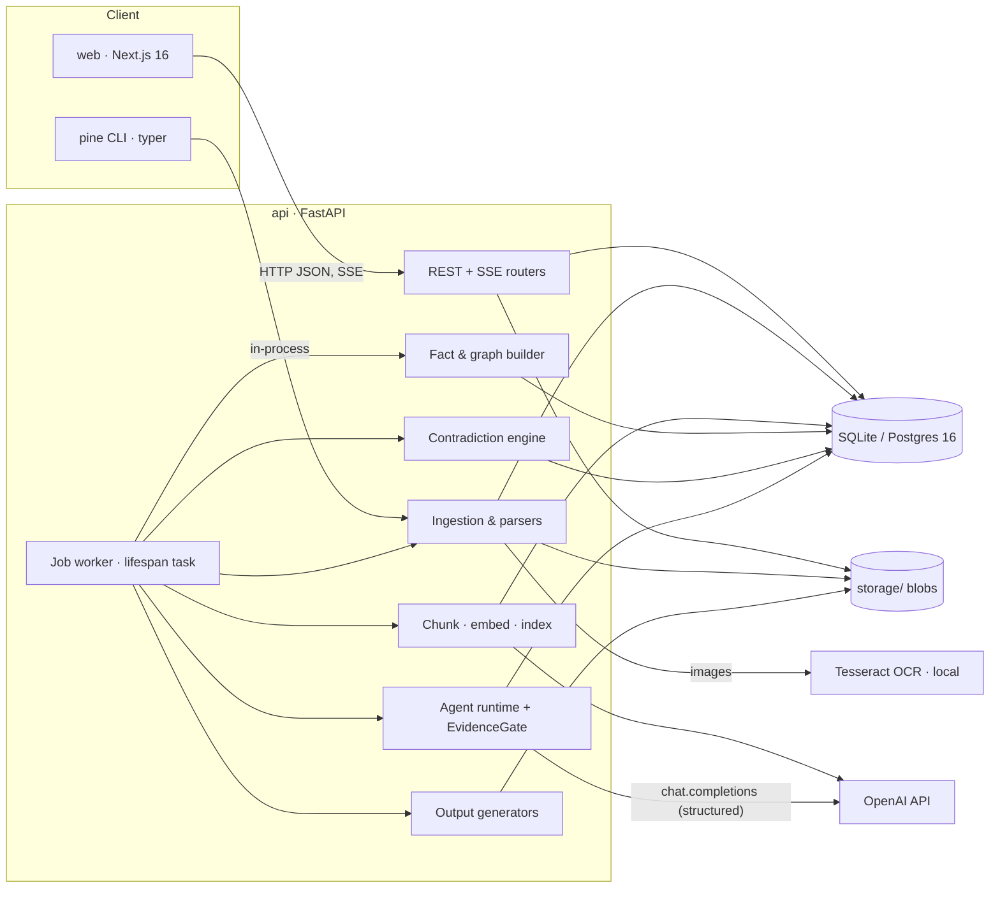
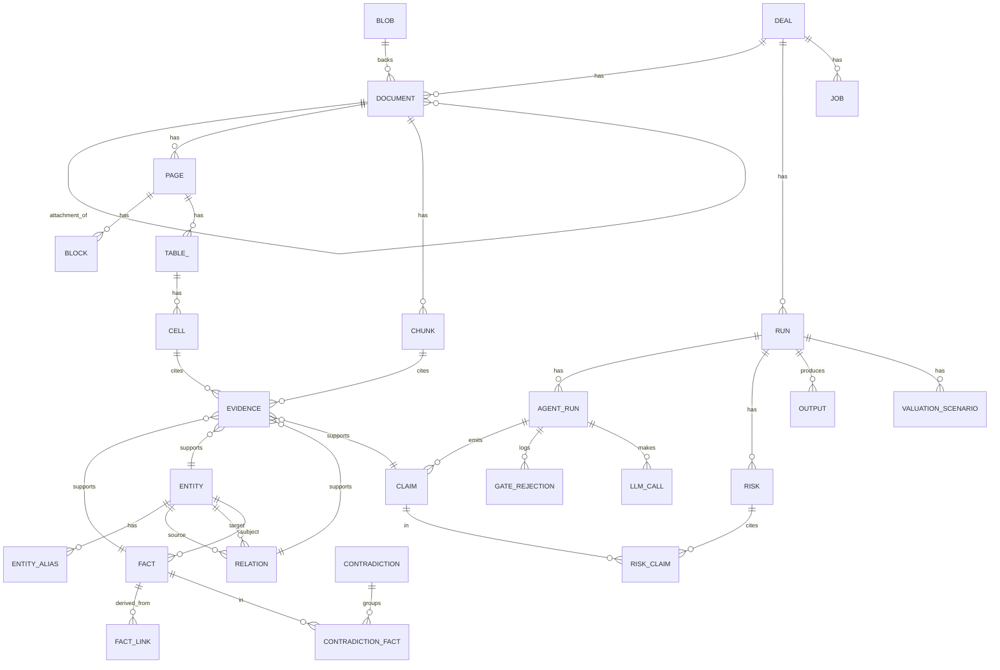
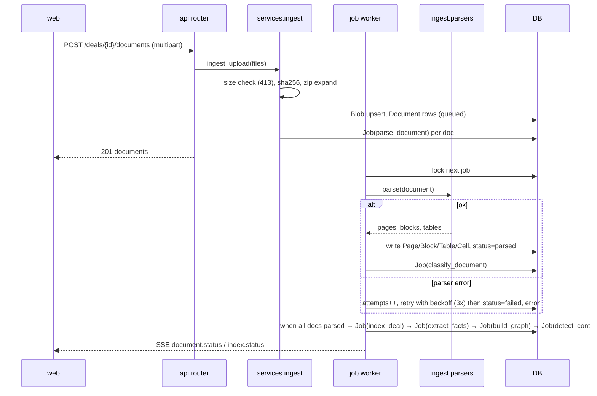

# Pine — Architecture

> Version 1.0 · Updated 2026-09-23 · If any other document or code disagrees with this file, this file wins.

## 1. System Overview

Pine is a two-app monorepo: a Python engine (`api/`) that owns ingestion, extraction, the evidence store, the knowledge graph, the contradiction engine and the agent pipeline, and a Next.js dashboard (`web/`) that only talks to the engine over HTTP/SSE. All state lives in one relational database (SQLite by default, Postgres optional) plus a blob directory. Background work (parsing, indexing, agent runs) is executed by an in-process worker that polls a `job` table, so a restart resumes work.



## 2. Tech Stack

| Layer | Choice | Version | Rationale |
|---|---|---|---|
| Engine language | Python | 3.12 (pinned via `uv python pin`) | PDF/OCR/table ecosystem; 3.14 lacks wheels for PyMuPDF/Tesseract stack |
| Package manager | uv | latest | Fast, lockfile, pins interpreter |
| Web framework | FastAPI | 0.11x | Pydantic-native, SSE, async |
| ORM / migrations | SQLAlchemy 2 + Alembic | 2.x / 1.x | DB-agnostic; typed 2.0 style |
| Database | SQLite (default) / Postgres 16 | — | Zero-setup local; same schema in prod |
| Blob storage | Local filesystem `STORAGE_DIR` | — | MVP; interface allows S3 later |
| PDF text/layout | PyMuPDF (`pymupdf`) | 1.2x | Fast text + bbox + page rendering |
| PDF tables | pdfplumber | 0.11 | Reliable ruled/whitespace tables |
| OCR | Tesseract via `pytesseract` (optional extra) | 5.x | Local, free |
| Office files | openpyxl, python-docx, python-pptx, pandas | current | Standard |
| Tokenizer | tiktoken | current | Token-accurate chunking |
| Keyword search | rank-bm25 | 0.2 | In-process BM25 |
| Dense search | numpy cosine over stored float32 embeddings | — | ≤ 100k chunks fits in RAM |
| Embeddings | OpenAI `text-embedding-3-small` (1536-d); `hash` provider offline | — | Cheap, good; deterministic tests |
| LLM | OpenAI `gpt-5` (IC, Financial), `gpt-5-mini` (others, extraction); `fake` provider offline | — | Quality where it matters, cost elsewhere |
| Reranker | `none` default; `llm` (gpt-5-mini listwise) or `cross-encoder` (`sentence-transformers` optional extra) | — | Optional quality lift |
| Entity resolution | rapidfuzz | 3.x | Fast fuzzy matching |
| Graph utilities | networkx | 3.x | Export GraphML, traversals |
| CLI | typer + rich | current | Headless runs, evals |
| Web framework | Next.js (App Router) | 16 | RSC + streaming |
| Language | TypeScript | 5 | strict |
| Styling | Tailwind CSS | 4 | Tokens as CSS variables |
| UI primitives | shadcn/ui (Radix) | current | Accessible base |
| Data fetching | TanStack Query | 5 | Server state, SSE integration |
| Motion | `motion` (framer-motion) | 11/12 | Springs, layout animation |
| PDF rendering | pdf.js (`pdfjs-dist`) | 4 | Page canvas + highlight overlay |
| Graph rendering | `react-force-graph-2d` | current | Force layout, canvas |
| Icons | lucide-react | current | Consistent stroke |
| Tests (api) | pytest, hypothesis, httpx TestClient | current | — |
| Tests (web) | Vitest + Testing Library, Playwright | current | Component + E2E |
| Lint | ruff, mypy (strict), ESLint, Prettier | current | — |
| CI | GitHub Actions | — | Free for public repo |

## 3. Component Boundaries

| Component | Responsibility | Owns | Exposes | Depends on | Must NOT |
|---|---|---|---|---|---|
| `api/pine/api/*` | HTTP routers, request/response schemas, SSE | nothing persistent | REST `/api/v1/*` | services | contain business logic; touch parsers/LLM directly |
| `api/pine/services/*` | Use-cases: create deal, ingest, start run, resolve contradiction | transactions | Python functions | repositories, jobs | know about HTTP |
| `api/pine/models/*` | SQLAlchemy entities (§4) | schema | ORM classes | `db.py` | contain logic beyond simple properties |
| `api/pine/ingest/*` | File type detection, parsers → `Page/Block/Table` | parser registry | `parse(document) -> ParseResult` | storage | call LLMs |
| `api/pine/index/*` | Chunking, embeddings, BM25/dense/hybrid retrieval, rerank | chunk + embedding rows | `Retriever.search()` | `llm/embeddings` | know about agents |
| `api/pine/facts/*` | Deterministic table extractors, LLM prose extraction, derivations, `EvidenceStore` | Fact/Evidence rows | `extract_facts(deal)` | index, llm | create Facts without Evidence |
| `api/pine/graph/*` | Entity/relation extraction, entity resolution, export | Entity/Relation rows | `build_graph(deal)` | facts | store entity without evidence |
| `api/pine/contradictions/*` | Rules R1–R7, period comparability, resolution | Contradiction rows | `detect(deal)` | facts | use LLMs |
| `api/pine/agents/*` | Agent runtime, tools, prompts, `EvidenceGate`, orchestrator DAG | Claim/GateRejection rows | `run_pipeline(run_id)` | index, facts, graph, contradictions, llm | write Facts (agents read; only `facts/` writes) |
| `api/pine/outputs/*` | Memo (MD/DOCX), XLSX model, risk matrix, contradiction report, source map, valuation | Output rows + files | `generate(kind, run)` | claims, facts | call LLMs (rendering only) |
| `api/pine/llm/*` | Provider interface (`complete_structured`, `embed`), OpenAI + fake/hash impls, token accounting, cache | LLMCall rows | `LLM`, `Embedder` | httpx/openai | be imported by `ingest/` or `contradictions/` |
| `api/pine/jobs/*` | Job table, worker loop, retries | Job rows | `enqueue(kind, payload)` | services | run outside a DB transaction boundary |
| `api/pine/storage/*` | Blob put/get by sha256 | files | `BlobStore` | fs | — |
| `web/src/lib/api/*` | Typed client, zod schemas mirroring §5, SSE hook | — | hooks | fetch | call endpoints not in §5 |
| `web/src/app/*` | Routes (§7) | URL state | pages | components, hooks | fetch outside `lib/api` |
| `web/src/components/*` | UI + domain components | local state | components | tokens | hard-code colours/px |

Shared contract: JSON schemas for API payloads are generated from FastAPI's OpenAPI (`make generate` → `web/src/lib/api/types.ts` via `openapi-typescript`). Web never hand-writes response types.

## 4. Data Model

IDs: UUIDv7 strings (`id: str(36)`), generated in Python (`uuid_utils`) so SQLite and Postgres behave identically. Timestamps: `created_at`, `updated_at` UTC `datetime` on every table (mixin). Tenancy: `deal_id` on every deal-scoped table, indexed. Soft delete: only `Deal` (`deleted_at`); everything else hard-deletes via cascade. Money: `value: Numeric(20,4)` + `currency: str(3)`; never floats for money. Enums are Python `StrEnum`s stored as strings.



### Entities

**Deal**
| Field | Type | Constraints | Notes |
|---|---|---|---|
| id | str(36) | PK | uuid7 |
| name | str(200) | not null | "Northwind SaaS — Series B" |
| company_name | str(200) | not null | |
| stage | enum DealStage | default `series_b` | seed, series_a, series_b, growth, buyout, other |
| currency | str(3) | default `USD` | ISO 4217 |
| fiscal_year_end_month | int | default 12, 1–12 | |
| proposed_round_usd | Numeric(20,4) | nullable | for valuation ownership calc |
| proposed_pre_money_usd | Numeric(20,4) | nullable | |
| deleted_at | datetime | nullable | soft delete |

**Blob** — `id, sha256 str(64) unique, size_bytes int, mime str(120), path str(500)` (relative to STORAGE_DIR).

**Document**
| Field | Type | Constraints | Notes |
|---|---|---|---|
| id | str(36) | PK | |
| deal_id | FK deal | not null, idx | |
| blob_id | FK blob | not null | |
| parent_document_id | FK document | nullable | email attachments, zip members keep `path` instead |
| filename | str(300) | not null | |
| path | str(1000) | not null | folder path inside upload/zip |
| ext | str(10) | not null | lowercased |
| doc_type | enum DocType | default `unknown` | deck, financial_statement, bank_statement, customer_list, contract, cap_table, board_deck, email, legal, other, unknown — set by classifier |
| status | enum DocStatus | default `queued` | queued, parsing, parsed, failed, unsupported |
| error | text | nullable | parser error |
| page_count | int | default 0 | |
| language | str(8) | nullable | |
| doc_date | date | nullable | inferred "as of" |
| meta | JSON | default {} | author, title, sheet names |
Unique: (deal_id, blob_id, path). Index: (deal_id, status), (deal_id, doc_type).

**Page** — `id, document_id FK idx, page_no int (1-based; sheet index for spreadsheets), width float, height float, is_scanned bool default false, sheet_name str(100) nullable, text text`. Unique (document_id, page_no).

**Block** — `id, page_id FK idx, order int, kind enum BlockKind (heading, paragraph, list_item, table, figure, caption, header, footer, slide_note), text text, bbox JSON [x0,y0,x1,y1] nullable, char_start int, char_end int` (offsets into `Page.text`). Unique (page_id, order).

**Table_** (class `Table`, table name `data_table`) — `id, page_id FK idx, block_id FK nullable, order int, n_rows int, n_cols int, header_row int nullable, sheet_name str(100) nullable, column_types JSON` (`["text","number","currency","date","percent"]`), `bbox JSON nullable`, `title str(300) nullable`.

**Cell** — `id, table_id FK idx, row int, col int, text text, value_num Numeric(24,6) nullable, value_date date nullable, bbox JSON nullable, ref str(12) nullable` (e.g. `B14`). Unique (table_id, row, col).

**Chunk** — `id, deal_id FK idx, document_id FK idx, page_no int, block_ids JSON [str], text text, token_count int, char_start int, char_end int, kind enum ChunkKind (prose, table_rows, slide, email, cells), table_id FK nullable, row_start int nullable, row_end int nullable, embedding LargeBinary nullable` (float32 little-endian, dim in `embedding_dim int`), `embedding_model str(80) nullable, text_hash str(64) idx`. Index (deal_id, document_id, page_no).

**Evidence**
| Field | Type | Constraints | Notes |
|---|---|---|---|
| id | str(36) | PK | |
| deal_id | FK deal | not null, idx | |
| document_id | FK document | not null, idx | |
| page_no | int | not null | |
| chunk_id | FK chunk | nullable | prose evidence |
| cell_id | FK cell | nullable | table evidence |
| char_start / char_end | int | nullable | offsets in chunk.text |
| quote | text | not null | exact substring of chunk.text or cell.text (validated) |
| bbox | JSON | nullable | for viewer highlight |
| target_kind | enum EvidenceTarget | not null | fact, entity, relation, claim |
| target_id | str(36) | not null, idx | polymorphic; FK enforced in service layer + tests |
Check: `chunk_id IS NOT NULL OR cell_id IS NOT NULL`. Index (target_kind, target_id).

**Entity** — `id, deal_id FK idx, type enum EntityType (company, customer, contract, revenue_stream, invoice, person, shareholder, security_class, liability, bank_account, employee, market), canonical_name str(300), normalized_name str(300) idx, attrs JSON` (typed per entity type in `packages/schemas/entities.py`; e.g. contract: `start_date, end_date, auto_renew, change_of_control, tcv, counterparty_entity_id`), `confidence float 0–1, merged_into_id FK entity nullable`. Unique (deal_id, type, normalized_name) where merged_into_id is null.

**EntityAlias** — `id, entity_id FK idx, alias str(300), normalized str(300), source_document_id FK`.

**Relation** — `id, deal_id FK idx, type enum RelationType (has_customer, has_contract, generates_revenue, billed_by, owns_shares, employs, owes, banks_with, competes_in), source_entity_id FK idx, target_entity_id FK idx, attrs JSON, confidence float`. Unique (type, source_entity_id, target_entity_id).

**Fact**
| Field | Type | Constraints | Notes |
|---|---|---|---|
| id | str(36) | PK | |
| deal_id | FK deal | idx | |
| subject_entity_id | FK entity | not null | usually the Company |
| metric | str(60) | not null, idx | controlled vocabulary `MetricId` |
| value | Numeric(24,6) | nullable | numeric facts |
| value_text | str(500) | nullable | categorical facts (e.g. `revenue_recognition_policy`) |
| unit | enum Unit | not null | currency, percent, count, months, ratio, text |
| currency | str(3) | nullable | required when unit = currency |
| period_type | enum PeriodType | not null | point, month, quarter, fiscal_year, ttm, custom |
| period_start / period_end | date | nullable | inclusive; point facts use `as_of` |
| as_of | date | nullable | |
| source_kind | enum DocType | not null | copied from document at extraction |
| extraction_method | enum ExtractionMethod | not null | table, llm, derived, manual |
| confidence | float | not null | 0–1 |
| is_authoritative | bool | default false | set by contradiction resolution |
| superseded_by_id | FK fact | nullable | manual correction |
| notes | text | nullable | |
Index (deal_id, metric, period_start, period_end). Rule: every Fact has ≥ 1 Evidence unless `extraction_method = derived` (then ≥ 1 `FactLink`). Enforced by `facts/store.py` (`EvidenceStore.add_fact` raises `EvidenceRequired`) and by test `tests/facts/test_invariants.py`.

**FactLink** — `fact_id FK, parent_fact_id FK, role str(30)` (`numerator`, `denominator`, `addend`). PK (fact_id, parent_fact_id).

**Contradiction**
| Field | Type | Constraints | Notes |
|---|---|---|---|
| id | str(36) | PK | |
| deal_id | FK idx | | |
| rule_id | str(8) | not null | R1…R7 |
| metric | str(60) | nullable | |
| severity | enum Severity | not null | info, low, medium, high, critical |
| status | enum ContradictionStatus | default `open` | open, resolved, dismissed |
| explanation | text | not null | templated |
| spread_pct | float | nullable | max relative disagreement |
| authoritative_fact_id | FK fact | nullable | |
| resolution_note | text | nullable | |
| resolved_at | datetime | nullable | |
| fingerprint | str(64) | unique per deal | sha256(rule, sorted fact ids) — idempotent re-runs |

**ContradictionFact** — `contradiction_id FK, fact_id FK, role str(20)` (`member`, `expected_sum`, `component`). PK (contradiction_id, fact_id).

**Job** — `id, deal_id FK idx nullable, kind enum JobKind (parse_document, classify_document, index_deal, extract_facts, build_graph, detect_contradictions, run_pipeline, generate_output), payload JSON, status enum JobStatus (queued, running, succeeded, failed, cancelled), attempts int default 0, max_attempts int default 3, run_after datetime, locked_by str(64) nullable, locked_at datetime nullable, error text nullable, idempotency_key str(120) unique nullable`. Index (status, run_after).

**Run** — `id, deal_id FK idx, status enum RunStatus (queued, running, completed, failed, cancelled), started_at, finished_at, duration_ms int, tokens_in int default 0, tokens_out int default 0, cost_usd Numeric(10,4) default 0, llm_provider str(30), config JSON` (models, prompt hashes), `error text nullable`.

**AgentRun** — `id, run_id FK idx, agent enum AgentName (document, financial, accounting, legal, market, contradiction, risk, investment_committee), status enum AgentStatus (pending, running, completed, failed, iteration_limit, timeout), iterations int, started_at, finished_at, duration_ms, tokens_in, tokens_out, cost_usd, model str(60), prompt_hash str(64), summary text nullable, error text nullable`. Unique (run_id, agent).

**Claim**
| Field | Type | Constraints | Notes |
|---|---|---|---|
| id | str(36) | PK | |
| deal_id, run_id, agent_run_id | FKs idx | | |
| section | str(60) | not null | memo section key, e.g. `revenue` |
| kind | enum ClaimKind | not null | fact, inference, opinion |
| text | text | not null | one sentence |
| quote | text | nullable | required for `fact`; must be substring of evidence text |
| fact_ids | JSON [str] | default [] | |
| confidence | float | | |
| order | int | | render order in section |
Evidence rows reference claims with `target_kind = claim`.

**GateRejection** — `id, agent_run_id FK idx, reason enum GateReason (no_evidence, evidence_not_found, quote_mismatch, fact_not_found, opinion_not_allowed, schema_invalid), raw JSON, created_at`.

**LLMCall** — `id, agent_run_id FK nullable idx, deal_id FK nullable, purpose str(40)` (extract_facts, agent_step, rerank, embed), `model, tokens_in, tokens_out, cost_usd, latency_ms, cache_hit bool, request_hash str(64) idx, response JSON nullable` (stored only when `LLM_CACHE=1`).

**Risk** — `id, run_id FK idx, deal_id, title str(200), category enum RiskCategory (financial, legal, market, operational, team, accounting, data_quality), likelihood int 1–5, impact int 1–5, score int` (= likelihood×impact), `description text, mitigations text, contradiction_id FK nullable`. **RiskClaim** — PK (risk_id, claim_id).

**ValuationScenario** — `id, run_id FK idx, deal_id, name enum (bear, base, bull), method enum (revenue_multiple, dcf), assumptions JSON` (`[{key, value, fact_id|null, is_assumption}]`), `enterprise_value Numeric(20,4), equity_value Numeric(20,4) nullable, implied_ownership_pct float nullable, notes text`.

**Output** — `id, run_id FK idx, deal_id, kind enum OutputKind (memo_md, memo_docx, model_xlsx, risk_matrix_json, risk_matrix_md, contradiction_report_md, contradiction_report_json, source_map_json, valuation_json, graph_json, graph_graphml), blob_id FK, status enum (generating, ready, stale, error), version int, generated_at, error text nullable`. Unique (run_id, kind, version).

### Migrations
Alembic in `api/alembic/`, autogenerate then hand-review; file names `YYYYMMDD_HHMM_<slug>.py`. Never edit an applied migration; add a new one. SQLite ALTERs use `batch_alter_table`. Seed/demo data is not a migration (`pine demo load`).

## 5. API Specification

Conventions: base `/api/v1`; JSON; auth header `X-API-Key: <PINE_API_KEY>` required when the key is configured (all routes except `/health`); pagination by cursor `?cursor=&limit=` (default 50, max 200) returning `{items, next_cursor}`; filtering via query params listed per endpoint; POSTs that create work accept `Idempotency-Key` header (stored on `Job.idempotency_key`). Error envelope: `{"error": {"code": "STRING_CODE", "message": "human text", "details": {}}}`. Rate limit: 60 write requests/min per API key (in-memory token bucket) → `429 RATE_LIMITED`.

Error code catalogue: `VALIDATION` 422 · `UNAUTHORIZED` 401 · `NOT_FOUND` 404 · `CONFLICT` 409 · `FILE_TOO_LARGE` 413 · `DEAL_QUOTA_EXCEEDED` 413 · `UNSUPPORTED_TYPE` 415 · `RUN_IN_PROGRESS` 409 · `MISSING_INPUTS` 422 · `RATE_LIMITED` 429 · `PROVIDER_ERROR` 502 · `COST_CAP_EXCEEDED` 402 · `INTERNAL` 500.

| Method | Path | Request | Response | Codes | Feature |
|---|---|---|---|---|---|
| GET | /health | — | `200 {status, version, db: "ok"}` | — | — |
| POST | /deals | `DealCreate {name, company_name, stage?, currency?, fiscal_year_end_month?, proposed_round_usd?, proposed_pre_money_usd?}` | `201 Deal` | 422 | F-01 |
| GET | /deals | `?cursor&limit` | `200 {items: DealSummary[], next_cursor}` (summary adds `document_count, last_run_status, open_contradictions`) | — | F-01, F-13 |
| GET | /deals/{id} | — | `200 Deal` | 404 | F-01 |
| PATCH | /deals/{id} | `DealUpdate` (all optional) | `200 Deal` | 404, 422 | F-01 |
| DELETE | /deals/{id} | — | `204` | 404 | F-01 |
| POST | /deals/{id}/documents | multipart `files[]` (+ optional `paths[]`); zips expanded | `201 {documents: Document[], skipped: [{filename, reason}]}` | 413 FILE_TOO_LARGE / DEAL_QUOTA_EXCEEDED, 404 | F-01 |
| GET | /deals/{id}/documents | `?status&doc_type&cursor&limit` | `200 {items: Document[], next_cursor}` | 404 | F-01, F-13 |
| GET | /documents/{id} | — | `200 DocumentDetail {…Document, pages: PageSummary[], tables: TableSummary[]}` | 404 | F-02, F-11 |
| GET | /documents/{id}/pages/{n} | — | `200 Page {page_no, text, blocks: Block[], tables: Table[], is_scanned}` | 404 | F-11 |
| GET | /documents/{id}/render/{n} | `?scale=1.5` | `200 image/png` (PDF/image docs) | 404, 415 | F-11 |
| GET | /documents/{id}/file | — | `200` original bytes, `Content-Disposition` | 404 | F-11 |
| POST | /documents/{id}/reparse | — | `202 {job_id}` | 404 | F-02 |
| GET | /tables/{id} | — | `200 TableDetail {…, cells: Cell[][]}` | 404 | F-02, F-11 |
| POST | /deals/{id}/search | `SearchRequest {query, k?=10, filters?: {doc_types?, document_ids?, date_from?, date_to?}, rerank?}` | `200 {results: SearchHit[]}` where `SearchHit {chunk_id, document_id, filename, page_no, text, score, bm25_rank, dense_rank}` | 404, 422 | F-03 |
| POST | /deals/{id}/index | — | `202 {job_id}` | 404 | F-03 |
| GET | /deals/{id}/index | — | `200 {status: indexing\|ready\|stale\|empty, chunk_count, embedded_count, embedding_model}` | 404 | F-03 |
| GET | /deals/{id}/facts | `?metric&period_from&period_to&source_kind&cursor&limit` | `200 {items: Fact[], next_cursor}` (`Fact` includes `evidence: Evidence[]`, `contested: bool`) | 404 | F-05, F-13 |
| GET | /facts/{id} | — | `200 FactDetail {…Fact, derived_from: Fact[], contradictions: ContradictionSummary[]}` | 404 | F-05, F-11 |
| PATCH | /facts/{id} | `{value?, notes?, is_authoritative?}` | `200 Fact` (creates a `manual` superseding fact when value changes) | 404, 422 | F-06 |
| GET | /deals/{id}/overview | — | `200 Overview {sections: OverviewSection[]}`; `OverviewSection {key: revenue\|customers\|margins\|cap_table\|contracts\|liabilities\|hiring\|cash\|forecast\|risks, headline: [{metric, fact: Fact\|null, contested: bool, missing: bool}], counts: {}}` | 404 | F-13 |
| GET | /deals/{id}/graph | `?types&limit` | `200 {nodes: Entity[], edges: Relation[]}` | 404 | F-04, F-13 |
| GET | /entities/{id} | — | `200 EntityDetail {…Entity, aliases, evidence: Evidence[], relations: Relation[], facts: Fact[]}` | 404 | F-04 |
| POST | /entities/{id}/merge | `{into_entity_id}` | `200 Entity` | 404, 409 | F-04 |
| POST | /entities/{id}/split | `{alias_ids: string[]}` | `201 Entity` | 404, 422 | F-04 |
| GET | /deals/{id}/contradictions | `?status&severity&rule_id&cursor&limit` | `200 {items: Contradiction[], next_cursor}` (`Contradiction` includes `facts: Fact[]` with evidence) | 404 | F-06, F-11 |
| GET | /contradictions/{id} | — | `200 ContradictionDetail` (+ `management_question`, `claims`) | 404 | F-06 |
| POST | /contradictions/{id}/resolve | `{authoritative_fact_id?, dismiss?: bool, note?}` (exactly one of the first two) | `200 Contradiction` (enqueues `generate_output` stale refresh) | 404, 422 | F-06 |
| POST | /deals/{id}/runs | `{agents?: AgentName[], force?: bool}` + `Idempotency-Key` | `202 Run` | 404, 409 RUN_IN_PROGRESS, 402 COST_CAP_EXCEEDED | F-07 |
| GET | /deals/{id}/runs | — | `200 {items: Run[]}` | 404 | F-15 |
| GET | /runs/{id} | — | `200 RunDetail {…Run, agents: AgentRun[], outputs: Output[]}` | 404 | F-07, F-15 |
| POST | /runs/{id}/cancel | — | `200 Run` | 404, 409 | F-07 |
| GET | /runs/{id}/events | SSE | `text/event-stream`, events below | 404 | F-13 |
| GET | /runs/{id}/claims | `?section&kind&agent` | `200 {items: Claim[]}` (with `evidence`) | 404 | F-07, F-08 |
| GET | /runs/{id}/rejections | — | `200 {items: GateRejection[]}` | 404 | F-07 |
| GET | /deals/{id}/outputs | — | `200 {items: Output[]}` (latest run) | 404 | F-08…F-12 |
| GET | /deals/{id}/outputs/{kind} | `?version` | `200` file bytes (md/json/xlsx/docx) or `409 {status: generating}` | 404, 409 | F-08…F-12 |
| POST | /deals/{id}/outputs/{kind}/regenerate | — | `202 {job_id}` | 404 | F-08…F-12 |
| GET | /deals/{id}/risks | — | `200 {items: Risk[]}` (with claims + evidence) | 404 | F-10 |
| GET | /deals/{id}/valuation | — | `200 {status: ready\|missing_inputs, missing: string[], scenarios: ValuationScenario[]}` | 404 | F-12 |
| GET | /deals/{id}/source-map | — | `200 SourceMap {claims: [{claim_id, section, text, evidence: [{evidence_id, document_id, filename, page_no, quote, bbox}]}]}` | 404 | F-11 |
| POST | /demo | `{name?}` | `202 {deal_id, run_id}` builds fixtures if missing, uploads, starts run | 409 if already loading | F-14 |
| GET | /jobs/{id} | — | `200 Job` | 404 | F-02 |

SSE events on `/runs/{id}/events` (payloads JSON): `run.status {status}`, `agent.status {agent, status, iterations}`, `agent.log {agent, message}` (tool calls summarised), `claim.accepted {claim_id, section}`, `claim.rejected {reason}`, `output.ready {kind}`, `heartbeat {}` every 15 s. Same events for ingestion on `GET /deals/{id}/events`: `document.status {document_id, status}`, `index.status {status, embedded_count}`.

Example — `POST /api/v1/deals/{id}/search`
```json
{"query": "annual recurring revenue", "k": 5, "filters": {"doc_types": ["deck", "customer_list"]}}
```
```json
{"results": [{"chunk_id": "0192…", "document_id": "0192…", "filename": "Northwind_SeriesB_Deck.pptx", "page_no": 7, "text": "ARR reached $12.0M in Q4 2025, up 3x YoY…", "score": 0.0324, "bm25_rank": 1, "dense_rank": 2}]}
```

## 6. Data Flows

### Ingestion


### Agent run with evidence gate
```mermaid
sequenceDiagram
  participant W as web
  participant API
  participant O as agents.orchestrator
  participant A as Agent
  participant L as llm provider
  participant G as EvidenceGate
  participant DB
  W->>API: POST /deals/{id}/runs
  API->>DB: Run(queued), cost pre-check (402 if over cap)
  API-->>W: 202 Run
  O->>DB: Run running; AgentRun rows pending
  loop DAG order (document → financial ∥ accounting ∥ legal ∥ market → contradiction → risk → investment_committee)
    O->>A: run(context)
    loop ≤ 12 iterations, 120s
      A->>L: complete_structured(messages, tools, schema)
      L-->>A: tool_call | final ClaimSet
      A->>DB: tool exec (search/get_facts/…)
    end
    A-->>G: ClaimSet
    G->>DB: resolve evidence ids, substring check quote
    G->>DB: Claim + Evidence rows (accepted) / GateRejection (dropped)
    O-->>W: SSE agent.status, claim.accepted/rejected
  end
  O->>DB: Job(generate_output) × kinds
  O->>DB: Run completed (tokens, cost)
```

### Contradiction resolution
`POST /contradictions/{id}/resolve` → service sets `is_authoritative` on chosen fact (clears on siblings) → `status=resolved` → marks Outputs `stale` → enqueues `generate_output` for memo/model/valuation/source_map → SSE `output.ready`.

## 7. Frontend Architecture

| Path | Page | Data | Endpoints | Features |
|---|---|---|---|---|
| `/` | Deals list + create + "Load demo" | deals | GET/POST /deals, POST /demo | F-01, F-14 |
| `/deals/[id]` | Overview tree (10 sections) + run panel | overview, latest run | GET /deals/{id}/overview, GET /deals/{id}/runs, SSE /runs/{id}/events, POST /deals/{id}/runs | F-13, F-07 |
| `/deals/[id]/documents` | Document table, upload dropzone, unreadable group | documents, index status | GET/POST documents, GET index, POST index, SSE /deals/{id}/events | F-01, F-02, F-03 |
| `/deals/[id]/documents/[docId]` | Viewer (pdf.js or table) with highlights; `?page=&evidence=` | document, page, render | GET /documents/{id}, /pages/{n}, /render/{n}, /tables/{id} | F-11 |
| `/deals/[id]/search` | Hybrid search box + results | hits | POST /deals/{id}/search | F-03 |
| `/deals/[id]/graph` | Force graph + entity side panel | graph, entity | GET /deals/{id}/graph, GET /entities/{id}, POST merge/split | F-04 |
| `/deals/[id]/facts` | Facts table with filters, contested chips | facts | GET /deals/{id}/facts, PATCH /facts/{id} | F-05 |
| `/deals/[id]/contradictions` | List + detail drawer + resolve | contradictions | GET …/contradictions, GET /contradictions/{id}, POST resolve | F-06, F-11 |
| `/deals/[id]/memo` | Memo reader with citation chips, opinion markers, download | claims, output | GET /runs/{id}/claims, GET outputs/memo_md, memo_docx | F-08 |
| `/deals/[id]/model` | Sheet preview (Historicals, Forecast, Valuation) + download | valuation, output | GET /deals/{id}/valuation, GET outputs/model_xlsx | F-09, F-12 |
| `/deals/[id]/risks` | 5×5 heat grid + list + detail | risks | GET /deals/{id}/risks | F-10 |
| `/deals/[id]/sources` | Source map explorer (output → claim → evidence) | source map | GET /deals/{id}/source-map | F-11 |
| `/deals/[id]/runs` | Run history, agent timings, tokens/cost, rejections | runs | GET /deals/{id}/runs, /runs/{id}, /runs/{id}/rejections | F-15 |

Layout: root layout (providers, theme) → `deals/[id]/layout.tsx` (deal header, section nav, run status pill) → page. State: server state in TanStack Query (keys `['deal', id]`, `['overview', id]`, …; SSE handler invalidates keys); URL state for filters, page, evidence id; client state only for viewer zoom and drawers. Data fetching via `web/src/lib/api/client.ts` + hooks in `web/src/lib/api/hooks.ts`; no fetch elsewhere. Forms with `react-hook-form` + zod schemas from `lib/api/schemas.ts`. Optimistic updates only for `resolve` and `PATCH /facts` (rollback on error). Every page exports `loading.tsx` (skeleton) and `error.tsx` (retry).

## 8. Third-Party Integrations

| Integration | Purpose | Package | Auth | Env | Failure / fallback | Local dev |
|---|---|---|---|---|---|---|
| OpenAI | LLM structured outputs, embeddings, LLM rerank | `openai` | Bearer key | `OPENAI_API_KEY`, `OPENAI_BASE_URL?` | Retries 3× exp backoff + jitter on 429/5xx, 60 s timeout; on persistent failure AgentRun `failed`, run continues with other agents; embeddings fall back to `hash` only if `EMBEDDINGS_FALLBACK=hash` | `LLM_PROVIDER=fake`, `EMBEDDINGS_PROVIDER=hash`; recorded fixtures in `api/tests/fixtures/llm/` |
| Tesseract | OCR | `pytesseract` (extra `ocr`) | — | `OCR_ENABLED`, `TESSERACT_CMD?` | If binary missing: page `is_scanned=true`, text empty, Document `meta.ocr_skipped=true`, warning surfaced in UI | `brew install tesseract` |
| sentence-transformers | cross-encoder rerank (optional) | extra `rerank` | — | `RERANKER=cross-encoder` | Falls back to `none` if import fails | optional |

No webhooks in MVP.

## 9. Background Jobs & Scheduling

Worker: asyncio task started in FastAPI lifespan (`WORKER_ENABLED=1`, default on; `pine worker` runs it standalone). Poll every 500 ms: `UPDATE job SET status='running', locked_by=?, locked_at=now() WHERE id = (SELECT id … WHERE status='queued' AND run_after<=now() ORDER BY created_at LIMIT 1)`. Concurrency `WORKER_CONCURRENCY=4` (parsers run in a thread pool). Retries: exponential backoff 5 s·2^attempts, max 3, then `failed` (dead-letter = failed rows, visible at `/deals/[id]/runs`). Stale locks (> 15 min) are released on startup. Idempotency keys: `parse:{document_id}`, `index:{deal_id}:{doc_count}`, `run:{run_id}`, `output:{run_id}:{kind}:{version}`.

| Job | Trigger | Timeout |
|---|---|---|
| parse_document | upload / reparse | 10 min |
| classify_document | after parse | 2 min |
| index_deal | all docs parsed / manual | 30 min |
| extract_facts | after index | 30 min |
| build_graph | after facts | 10 min |
| detect_contradictions | after graph / after fact edit | 2 min |
| run_pipeline | POST runs | 40 min |
| generate_output | end of run / resolve / regenerate | 5 min |

## 10. AI Subsystem

**Provider interface** (`api/pine/llm/base.py`):
```python
class LLM(Protocol):
    async def complete_structured(self, *, messages: list[Message], schema: type[BaseModel], tools: list[ToolSpec] | None = None, model: str, max_output_tokens: int) -> StructuredResult  # returns parsed model or tool calls + usage
class Embedder(Protocol):
    async def embed(self, texts: list[str]) -> list[list[float]]
```
Implementations: `OpenAILLM` (Responses API with `text.format = json_schema`, strict), `FakeLLM` (scripted responses keyed by `purpose`+regex on the last user message, loaded from `tests/fixtures/llm/*.yaml`; unknown → empty ClaimSet), `OpenAIEmbedder`, `HashEmbedder` (sha256-seeded 256-d deterministic vectors, normalised). Cache: `LLMCall.request_hash` = sha256(model, messages, schema) → return cached response when `LLM_CACHE=1` (default on in dev/tests).

**Model routing** (`api/pine/llm/routing.py`): `extract_facts → gpt-5-mini`, `document/legal/market/accounting/contradiction/risk agents → gpt-5-mini`, `financial + investment_committee → gpt-5`, `rerank → gpt-5-mini`. Overridable via `MODEL_<PURPOSE>` env vars.

**Prompts**: `api/pine/agents/prompts/<agent>.md` with front-matter `version:`; `prompt_hash` recorded on AgentRun. Every prompt contains the evidence contract: "Return claims. For kind=fact you MUST include `evidence_ids` returned by tools and a `quote` copied verbatim from tool output. Never invent numbers."

**Tools** (JSON Schema in `api/pine/agents/tools.py`): `search(query: str, k: int = 8, doc_types?: list[str])`, `get_facts(metric?: str, period_from?: date, period_to?: date)`, `get_entity(entity_id)`, `list_entities(type, limit)`, `get_contradictions(status='open')`, `open_document(document_id, page_no)`, `get_table(table_id, row_start?, row_end?)`. Each result item carries an `evidence_id` (a pre-created Evidence stub keyed by chunk/cell + quote span) so agents can only cite what they saw.

**Agent loop**: system prompt + task → model → (tool calls → execute → append) × ≤ 12 → final `ClaimSet {claims: Claim[], summary: str}`; structured-output failure → repair retry (≤ 2) with the validation error appended. Timeout 120 s per agent; total run cap `RUN_MAX_TOKENS=1_500_000`, `RUN_MAX_COST_USD=10`.

**EvidenceGate** (`api/pine/agents/gate.py`): for each claim — `fact` ⇒ ≥ 1 evidence id ∧ each resolves ∧ `quote` ⊂ evidence text (whitespace-normalised) ∧ any `fact_ids` exist; `inference` ⇒ ≥ 1 evidence id or fact id, all resolvable; `opinion` ⇒ agent = investment_committee, else reject. Rejections logged, never surfaced as content.

**Fact extraction**: deterministic table extractors first (`facts/extractors/{pnl,bank_statement,customer_list,cap_table}.py` match by header synonyms), then LLM extraction per prose chunk of classified docs with schema `ExtractedFact {metric: MetricId, value, unit, currency?, period: PeriodSpec, evidence_quote}`; quote substring check; dedupe by `(metric, period, value, document)`. Derived facts in `facts/derive.py` (runway, gross margin from revenue & COGS, NRR from cohort table, concentration from customer list).

**Retrieval**: chunker `index/chunker.py` (tiktoken `o200k_base`); BM25 index built per deal in memory and cached by `(deal_id, chunk_count)`; dense = numpy matmul over `float32` matrix loaded per deal (cached, invalidated on index); RRF k=60; optional rerank.

**Trace logging**: every LLM call → `LLMCall`; every agent step → `agent.log` SSE and structured log line `{run_id, agent, iteration, tool, latency_ms}`.

## 11. Security Architecture

- AuthN: static `X-API-Key` compared with `hmac.compare_digest`; web stores the key in an httpOnly cookie set by a Next.js route handler (`/api/session`) and proxies API calls server-side (`web/src/app/api/proxy/[...path]`), so the key never reaches the browser. When `PINE_API_KEY` is unset (local), everything is open and the UI shows a "local mode" badge.
- AuthZ: single workspace; no roles. All deal-scoped queries filter by `deal_id` via repository helpers (`repos/base.py: scoped(deal_id)`).
- Input validation: Pydantic at the router; file uploads: size limit, extension allowlist, MIME sniff (`python-magic` not used — use signature bytes in `ingest/detect.py`), zip-bomb guard (max 5 000 members, 2 GB expanded, no path traversal — normalised paths only).
- Secrets: env only; `.env` git-ignored; never logged. Bank account numbers redacted in logs by `logging/redact.py` (regex on 8+ digit runs in bank docs).
- Outbound: only OpenAI host (`OPENAI_BASE_URL` allowlist); no user-supplied URLs fetched.
- CORS: `WEB_ORIGIN` (default `http://localhost:3000`). Security headers on web: CSP (`default-src 'self'`; `worker-src blob:` for pdf.js), HSTS in prod.
- Encryption at rest is the host's responsibility (documented); Postgres TLS via `DATABASE_URL`.

## 12. Environments & Configuration

Environments: `local` (SQLite, fake/real providers, worker in-process), `ci` (SQLite in-memory, fake providers, OCR off), `prod` (Docker Compose: api + worker + web + Postgres 16 + volume for storage).

| Var | Required | Example | Used by | Secret |
|---|---|---|---|---|
| DATABASE_URL | no (default `sqlite:///./pine.db`) | `postgresql+psycopg://pine:pine@db:5432/pine` | api | yes if pw |
| STORAGE_DIR | no (`./storage`) | `/data/storage` | api | no |
| PINE_API_KEY | no | `pk_live_…` | api, web proxy | yes |
| OPENAI_API_KEY | when LLM_PROVIDER=openai | `sk-…` | api | yes |
| OPENAI_BASE_URL | no | `https://api.openai.com/v1` | api | no |
| LLM_PROVIDER | no (`fake`) | `openai` | api | no |
| EMBEDDINGS_PROVIDER | no (`hash`) | `openai` | api | no |
| EMBEDDINGS_FALLBACK | no | `hash` | api | no |
| RERANKER | no (`none`) | `llm` | api | no |
| MODEL_DEFAULT / MODEL_FINANCIAL / MODEL_IC / MODEL_EXTRACT / MODEL_RERANK | no | `gpt-5-mini` | api | no |
| LLM_CACHE | no (`1`) | `0` | api | no |
| RUN_MAX_TOKENS | no (`1500000`) | | api | no |
| RUN_MAX_COST_USD | no (`10`) | | api | no |
| OCR_ENABLED | no (`false`) | `true` | api | no |
| TESSERACT_CMD | no | `/opt/homebrew/bin/tesseract` | api | no |
| WORKER_ENABLED | no (`1`) | `0` for api-only | api | no |
| WORKER_CONCURRENCY | no (`4`) | | api | no |
| MAX_FILE_MB | no (`200`) | | api | no |
| MAX_DEAL_GB | no (`2`) | | api | no |
| WEB_ORIGIN | no (`http://localhost:3000`) | | api | no |
| LOG_LEVEL | no (`INFO`) | `DEBUG` | api | no |
| NEXT_PUBLIC_API_URL | no (`http://localhost:8000`) | | web (server proxy target) | no |
| PINE_API_KEY (web) | no | same as api | web proxy | yes |

## 13. Deployment & Infrastructure

- Local: `make install && make api` (uvicorn :8000 with worker) + `make web` (:3000).
- Prod: `docker compose up` from `deploy/docker-compose.yml`: `api` (uvicorn, `WORKER_ENABLED=0`), `worker` (`pine worker`), `web` (Next standalone), `db` (postgres:16, volume), `storage` volume. Images built by `.github/workflows/release.yml` on tags, pushed to GHCR.
- CI (`.github/workflows/ci.yml`): `api` job (uv sync, ruff, mypy, pytest with coverage, `pine eval demo --fake`), `web` job (pnpm install, lint, typecheck, vitest, build), `e2e` job (starts api with fake provider + web, Playwright). Required for merge to `main`.
- Migrations run on api start (`alembic upgrade head`) guarded by an advisory lock on Postgres / file lock on SQLite.
- Rollback: redeploy previous image tag; migrations are additive-only through P6 (no destructive DDL), so rollback needs no down-migration.
- Backups: `pine backup` dumps DB + storage tarball; restore rehearsal in P6 checklist.

## 14. Observability

Structured JSON logs (`structlog`-style via stdlib `logging` + JSON formatter) with `request_id` (middleware, echoed in `X-Request-Id`), `deal_id`, `run_id`, `agent`. Metrics endpoint `/metrics` (Prometheus text) with counters: jobs by kind/status, LLM tokens/cost by model, gate rejections by reason, parse durations. Errors: log + `Run.error`; optional Sentry via `SENTRY_DSN` (P6). Dashboards: `/deals/[id]/runs` is the in-product view.

## 15. Scalability & Performance

Expected load: tens of deals, ≤ 500 documents/deal, ≤ 100k chunks/deal. Bottlenecks: OCR (thread pool, optional), embeddings (batch 100, concurrent 4), LLM extraction (only classified financial/legal/deck prose chunks; cache by hash). Dense matrix per deal ≈ 100k × 1536 × 4 B = 600 MB worst case → switch to pgvector (ADR-004 trigger) beyond 250k chunks. BM25 rebuild is O(chunks) and cached.

## 16. Architecture Decision Records

- **ADR-001 Python engine + Next.js UI.** Context: OCR/PDF/table tooling. Decision: Python 3.12 for the engine, TS only for UI. Consequence: two toolchains; typed contract via OpenAPI codegen.
- **ADR-002 Single relational DB for graph + vectors.** Context: MVP simplicity. Decision: entities/relations/embeddings in SQLAlchemy tables; networkx for traversal; numpy for cosine. Consequence: no Neo4j/vector DB; revisit at scale.
- **ADR-003 Evidence as a first-class table with polymorphic target.** Context: the "no unsupported claims" guarantee. Decision: one `Evidence` table referenced by facts, entities, relations, claims; service-layer invariant + tests instead of DB FK. Consequence: uniform source map and viewer.
- **ADR-004 In-process job worker.** Context: no Redis in MVP. Decision: `job` table + lifespan worker; trigger for arq/Redis when concurrency > 1 host.
- **ADR-005 Deterministic contradiction engine, LLM only explains.** Context: trust. Decision: rules produce contradictions; `ContradictionAgent` only prioritises and drafts management questions. Consequence: reproducible flags; rule coverage must grow over time.
- **ADR-006 Fake providers are first-class.** Context: CI determinism and cost. Decision: `FakeLLM` + `HashEmbedder` ship in the package, demo evals run offline. Consequence: fixtures must be maintained with prompt changes.
